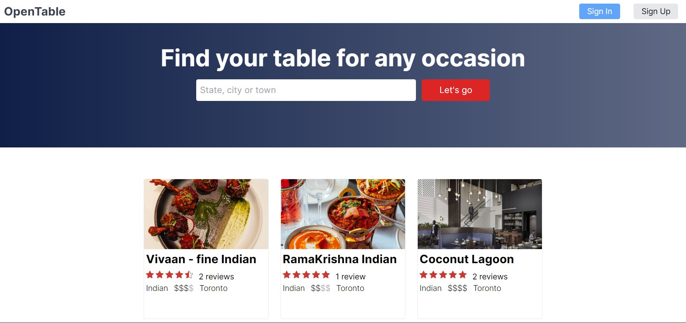

<a name="readme-top"></a>

<div align="center">

  <h1><b>Dine Spotter</b></h1>
  

</div>
<!-- TABLE OF CONTENTS -->

# 📗 Table of Contents

- [📖 About the Project](#about-project)
  - [🛠 Built With](#built-with)
    - [Tech Stack](#tech-stack)
    - [Key Features](#key-features)
- [💻 Getting Started](#getting-started)
  - [Prerequisites](#prerequisites)
  - [Setup](#setup)
  - [Install](#install)
  - [Usage](#usage)
- [👥 Authors](#authors)
- [🤝 Contributing](#contributing)
- [⭐️ Show your support](#support)
- [🙏 Acknowledgements](#acknowledgements)
- [📝 License](#license)

<!-- PROJECT DESCRIPTION -->

# 📖 Dine Spotter <a name="about-project"></a>

**Dine Spotter** is a desktop web application that serves as a clone of [open table](https://www.opentable.com/). Users can discover available tables based on the number of people, preferred time, and date for their reservation.

## 🛠 Built With <a name="built-with"></a>

### Tech Stack <a name="tech-stack"></a>

  <label>Client</label>
  <ul>
    <li><a href="https://www.typescriptlang.org/">NEXT.js</a></li>
    <li><a href="https://nextjs.org/">TypeScript</a></li>
    <li><a href="https://tailwindcss.com/">Tailwind CSS</a></li>
  </ul>
  <label>Server</label>
  <ul>
    <li><a href="https://tailwindcss.com/">Prisma</a></li>
  </ul>

<!-- Features -->

### Key Features <a name="key-features"></a>

- **Search features with filtering system**
- **Availability system for the desired booking time**
- **Booking system with your party sizes, time and day at your favourite restaurant**
- **Authentication sytem**

<p align="right">(<a href="#readme-top">back to top</a>)</p>

<!-- GETTING STARTED -->

## 💻 Getting Started <a name="getting-started"></a>

To get a local copy up and running, follow these steps.

### Prerequisites

In order to run this project you need:

- A Chrome browser
- npm
- Node.js

### Setup

Clone this repository to your desired folder:

```sh
  cd my-folder
  git clone https://github.com/K0ppai/Dine-Spotter.git
```

### Install

Install the prerequisites this project using:

```sh
  cd Dine-Spotter

  npm install
```

### Usage

To run the project, execute the following command:

```
  npm run dev
```

<p align="right">(<a href="#readme-top">back to top</a>)</p>

<!-- AUTHORS -->

## 👥 Authors <a name="authors"></a>

👤 **Paing Soe Thu**

- GitHub: [@K0ppai](https://github.com/K0ppai)
- Twitter: [@_koppai_](https://twitter.com/_koppai_)
- LinkedIn: [LinkedIn](https://www.linkedin.com/in/paingsoe-thu)

<p align="right">(<a href="#readme-top">back to top</a>)</p>

<!-- CONTRIBUTING -->

## 🤝 Contributing <a name="contributing"></a>

Contributions, issues, and feature requests are welcome!

Feel free to check the [issues page](https://github.com/K0ppai/Dine-Spotter/issues).

<p align="right">(<a href="#readme-top">back to top</a>)</p>

<!-- SUPPORT -->

## ⭐️ Show your support <a name="support"></a>

If you like this project, don't forget to give it a ⭐️!

<p align="right">(<a href="#readme-top">back to top</a>)</p>

<!-- ACKNOWLEDGEMENTS -->

## 🙏 Acknowledgments <a name="acknowledgements"></a>

I would like to give credit to the [opentable.com](https://www.opentable.com/) website for the designs and systems and the original author of the course [Laith Harb](https://github.com/harblaith7).

<p align="right">(<a href="#readme-top">back to top</a>)</p>

<!-- LICENSE -->

## 📝 License <a name="license"></a>

This project is [MIT](./LICENSE) licensed.

<p align="right">(<a href="#readme-top">back to top</a>)</p>
